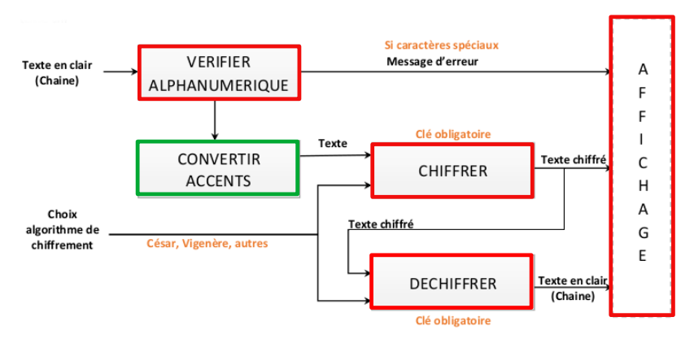

# R2.04-Mini-projet 
## **Projet 3 : Chiffrement de messages**
---
Créé par l'équipe 2 du groupe F composée de :
- Simon Armand
- Christian Gikapa
- Dorian Levasseur
- Sofia Gribanova

---
## **SOMMAIRE**
1. [Description de la demande](#projet)
2. [Descriptions des fonctions](#fonctions)
3. [Documentation d'utilisation](#doc)
4. [Aspects techniques](#techniques)

<h1 id="projet"><b> 1.Description de la demande </b> </h1>
Ce projet consiste à pouvoir chiffrer et à dechiffrer du texte en convertissant les accents.

On doit donc créer notre programme à partir de ce schéma :

<h1 id="fonctions"><b> 2.Descriptions des fonctions</b></h1>

## **Voici les fonctions developpées:**

### **SOMMAIRE DES FONCTIONS**
1. [verifier_alphanumerique](#verifier)
2. [convertir_accents](#convertir_accents)
3. [chiffrer](#chiffrer)
4. [dechiffrer](#dechiffrer)
5. [affichage](#affichage)
---

<h2><i> verifier_alphanumerique :</i> </h2>
    
 
But

        Vérifier si la chaine de caracteres ne contient pas des caracteres speciaux qui ne pourront pas etre chiffrés

    
 
Entrées | Sorties 

         

    
 
Erreur possibles

        test 

---

<h2><i> convertir_accents : </i> </h2>

 
But

        test 

    
 
Entrées | Sorties

        test 

    
 
Erreur possibles

        test 

---

<h2><i> chiffrer : </i></h2>

 
But

        test 

    
 
Entrées | Sorties

        test 

    
 
Erreur possibles

        test 

---

<h2><i> dechiffrer : </i></h2>

 
But

        test 

    
 
Entrées | Sorties

        test 

    
 
Erreur possibles

        test 

---

 
<h2><i> affichage : </i></h2>

 
But

        test 

    
 
Entrées | Sorties

        test 

    
 
Erreur possibles

        test 

---
<h1 id="doc"><b> 3.Documentation d'utilisation</b></h1>

## LES ETAPES 

<h1 id="techniques"><b> 4.Aspect techniques</b></h1>

1. L'algorithmique
    - Notre algorithme naïf du chiffrage de César:
    
    <code>
    Choix de la clé (nombre entre 1 et 25)
        Tant que le message n'est pas chiffré en entier :
	    Lire la lettre
	    Attribuer à la lettre son correspondant grace à la clé (si lettre = A et clé = 3, alors lettre = D)
	    Remplacer le correspondant dans le message
	    Passer a la lettre suivante
    Afficher le message code

    Pour dechiffrer, même méthode avec clé = - clé
    </code>
    - Notre algortithme naïf du Vigenère:

    <code>
    Choix de la clé (correspondant à un mot)
    Tant que le message n'est pas chiffré en entier :
	    Lire la lettre
	    Attribuer à la lettre son correspondant grace à la clé et à sa position (si lettre = A, clé = MUSIQUE et position = 3, alors lettre = S)
	    Remplacer le correspondant dans le message
	    Passer à la lettre suivante
    Afficher le message codé

    TexteChiffreFinal[i] = ( TexteClair[i] + Cle[i] ) mod 26
    </code>
 